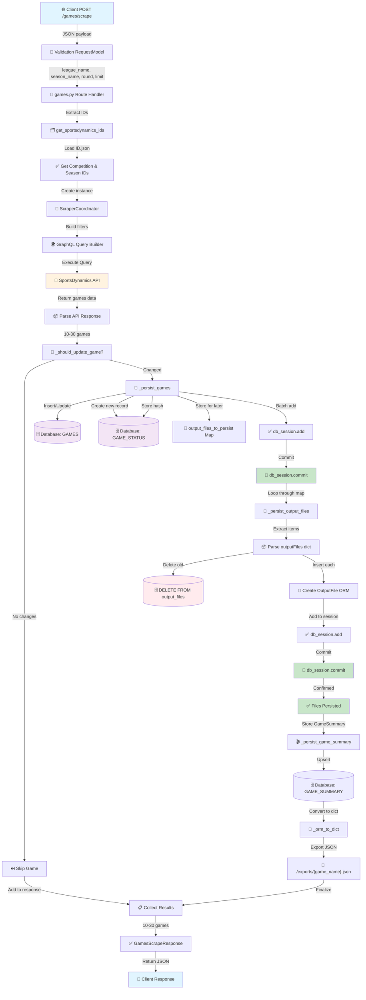

# 📊 Flux Complet : Appel POST /games/scrape

## Schéma du Flux



## 📋 Détail des Étapes

### 1️⃣ **Requête Client**
```json
POST /games/scrape HTTP/1.1
{
  "league_name": "Ligue 2",
  "season_name": "2026 - 2027",
  "round": "1",
  "limit": 3
}
```

### 2️⃣ **Routeur → get_sportsdynamics_ids()**
- Charge `start/ID.json` 
- Mappe "Ligue 2" → competitionId: "xxx"
- Mappe "2026 - 2027" → seasonId: "yyy"

### 3️⃣ **ScraperCoordinator → GraphQL Query**
```graphql
query {
  games(
    filter: {
      available: true,
      competition_id: "xxx",
      season_id: "yyy"
    },
    limit: 3
  ) {
    # ... 30+ fields
    outputFiles {
      items {
        id, fileName, fileType, version, isOutdated,
        file { url, size, name }
      }
    }
  }
}
```

### 4️⃣ **Vérification Incrémentale (_should_update_game)**
Pour chaque jeu :
- Calcule SHA256 hash de outputFiles
- Compare avec `GameStatus.output_files_hash` en DB
- Si hash identique → **SKIP** (données inchangées)
- Si différent → **UPDATE** (rédownload nécessaire)

### 5️⃣ **Persistance Games & Status**
```sql
INSERT INTO games (...) VALUES (...);
INSERT INTO game_status (game_id, output_files_hash, ...) VALUES (...);
COMMIT;
```

### 6️⃣ **Persistance OutputFiles (APRÈS commit)**
```sql
DELETE FROM output_files WHERE game_id = 'xxx';  -- Clean old
INSERT INTO output_files (
  id, game_id, file_name, file_type, version, 
  is_outdated, url, file_size, ...
) VALUES (...) FOR EACH file;
COMMIT;
```

### 7️⃣ **GameSummary & Export**
- Upsert `game_summary` (avec teams array JSONB)
- Export game complet en JSON → `/exports/1_Nantes_vs_Red_Star.json`

### 8️⃣ **Réponse Client**
```json
{
  "status": "success",
  "count": 3,
  "games": [
    {
      "id": "54e906b3-123a-4da0-bdae-332b25ddd77e",
      "name": "Nantes vs Red Star",
      "home_score": 0,
      "away_score": 1,
      "output_files": [
        {
          "id": "dbd860e1-09df-47d5-8cdb-076538c30fa3",
          "fileName": "phase_of_play_NAN_RED_54e906b3....xml",
          "fileType": "XML",
          "file": {
            "url": "https://s3.eu-west-1.amazonaws.com/...",
            "size": "298.96 KB",
            "name": "phase_of_play_NAN_RED_54e906b3....xml"
          }
        }
        // ... 9 autres fichiers
      ]
    }
    // ... 2 autres jeux
  ]
}
```

## 🗄️ État de la Base Après Appel

### games (3 enregistrements)
```
id                                   | name                | home_score | away_score | round_name
54e906b3-123a-4da0-bdae-332b25ddd77e | Nantes vs Red Star  | 0          | 1          | 1
64bfab89-18f6-466f-92d7-0669b659e2c1 | Pau vs Annecy       | 1          | 2          | 1
6ee1a85d-404d-4dae-b6d2-e7caf97797ff | Le Havre vs Angers  | 2          | 0          | 1
```

### game_status (3 enregistrements)
```
game_id                              | available | output_files_hash (SHA256) | last_checked_at
54e906b3-123a-4da0-bdae-332b25ddd77e | true      | 3f8a9c2b1e4d5f6a7b8c9d0e | 2026-08-14 13:22:57
...
```

### output_files (30 enregistrements = 10 par jeu)
```
id                                   | game_id                              | file_name                                    | file_type | file_size  | url
dbd860e1-09df-47d5-8cdb-076538c30fa3 | 54e906b3-123a-4da0-bdae-332b25ddd77e | phase_of_play_NAN_RED_54e906b3....xml       | XML       | 298.96 KB  | https://s3.eu-west-1.amazonaws.com/...
32d5f6a6-ed4d-4198-9532-3fd7f3600b8f | 54e906b3-123a-4da0-bdae-332b25ddd77e | match_highlights_NAN_RED_54e906b3....xml    | XML       | 27.46 KB   | https://s3.eu-west-1.amazonaws.com/...
694192ff-4d42-4f78-b086-42cea7dad367 | 54e906b3-123a-4da0-bdae-332b25ddd77e | rgd_54e906b3-123a-4da0-bdae-332b25ddd77e.json | JSON      | 11.28 MB   | https://s3.eu-west-1.amazonaws.com/...
... 27 autres fichiers pour les 3 jeux
```

### game_summary (3 enregistrements)
```
game_id                              | name                | available | teams (JSONB array)
54e906b3-123a-4da0-bdae-332b25ddd77e | Nantes vs Red Star  | true      | [{"id": "...", "name": "Nantes", ...}, {"id": "...", "name": "Red Star", ...}]
```

## 🎯 Points Clés

| Point | Détail |
|-------|--------|
| **Idempotence** | 2e appel avec mêmes paramètres → hash inchangé → skip, zéro insertion |
| **Incrémental** | Hash détecte changements outputFiles (nouvelles versions ou fichiers) |
| **Transactions** | Games + Status en une transaction, OutputFiles en deuxième transaction (évite autoflush) |
| **URLs** | S3 pre-signed URLs (1h valides), stockées intégralement dans TEXT column |
| **Cascade** | Supprimer un game → supprime automatiquement ses game_status + output_files |
| **Export** | Chaque game exporte en JSON pour archive/audit |

## 📊 Performances

| Opération | Temps |
|-----------|-------|
| GraphQL Query (3 jeux) | ~1-2s |
| DB Insert Games + Status | ~0.1s |
| DB Insert OutputFiles (30) | ~0.2s |
| GameSummary Upsert | ~0.1s |
| Export JSON (3 jeux) | ~0.05s |
| **Total** | **~1.5s** |

2e scrape (idempotent, skip) : **~0.5s** (juste les vérifications)
