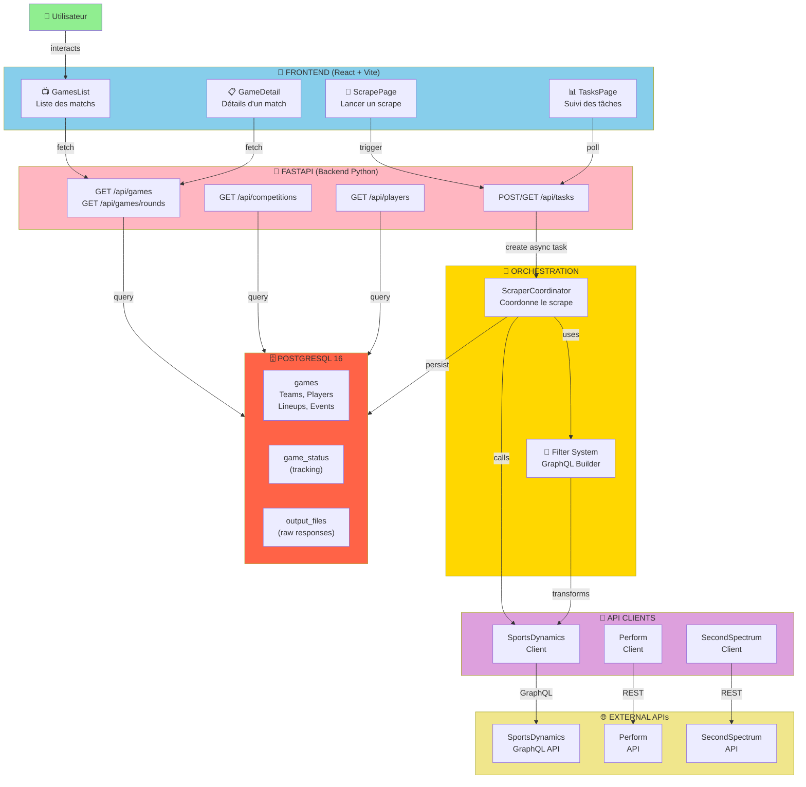
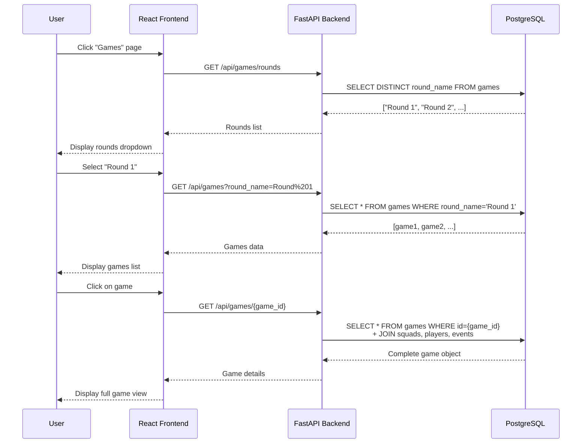
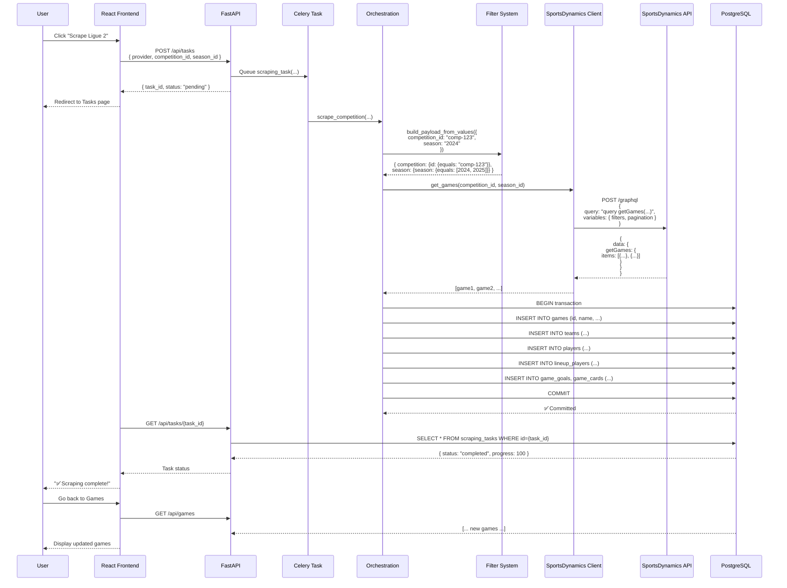
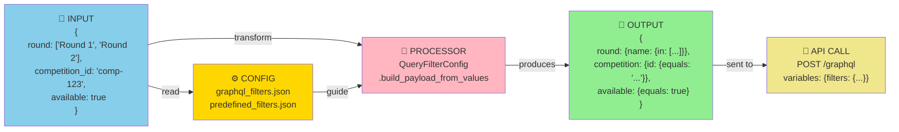
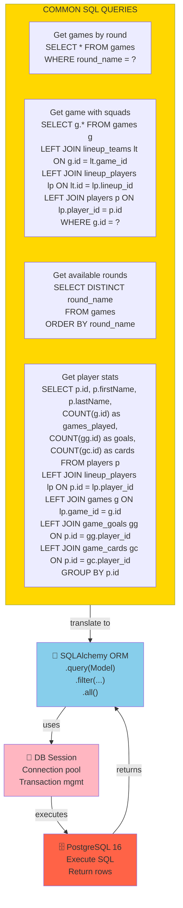
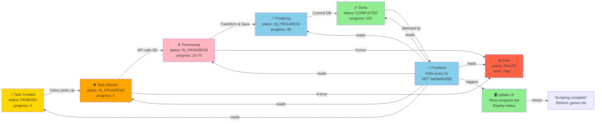

# 🎯 Scomp - Diagrammes Visuels Interactifs

---

## 📊 Diagramme 1: Architecture Globale (Couches)



---

## 🔄 Diagramme 2: Flux Détaillé - Affichage des Matchs



---

## 🔄 Diagramme 3: Flux Détaillé - Scraping avec GraphQL



---

## 📊 Diagramme 4: Transformation GraphQL (Filter System)



---

## 📈 Diagramme 5: Modèle de Données (Entities + Relations)

```mermaid
erDiagram
    COMPETITIONS ||--o{ SEASONS : has
    COMPETITIONS ||--o{ TEAMS : has
    SEASONS ||--o{ GAMES : contains
    GAMES ||--o{ PERIODS : divides
    GAMES ||--o{ LINEUPS : has
    GAMES ||--o{ GAME_GOALS : contains
    GAMES ||--o{ GAME_CARDS : contains
    GAMES ||--o{ GAME_STATUS : tracks
    GAMES ||--o{ OUTPUT_FILES : has
    
    TEAMS ||--o{ PLAYERS : has
    LINEUPS ||--o{ LINEUP_PLAYERS : contains
    LINEUP_PLAYERS }o--|| PLAYERS : "maps to"
    LINEUP_PLAYERS }o--|| TEAMS : "assigned to"
    
    GAME_GOALS }o--|| PLAYERS : "scored by"
    GAME_CARDS }o--|| PLAYERS : "received by"
    
    GAMES ||--o{ DISTANCE_ANALYTICS : measures

    COMPETITIONS : string id PK
    COMPETITIONS : string name
    COMPETITIONS : string region
    
    SEASONS : string id PK
    SEASONS : string season
    SEASONS : string competition_id FK
    
    GAMES : string id PK
    GAMES : string name
    GAMES : datetime starts_at
    GAMES : datetime played_at
    GAMES : int home_score
    GAMES : int away_score
    GAMES : string round_name
    GAMES : string competition_id FK
    GAMES : string season_id FK
    
    TEAMS : string id PK
    TEAMS : string name
    TEAMS : string brand
    TEAMS : string competition_id FK
    
    PLAYERS : string id PK
    PLAYERS : string firstName
    PLAYERS : string lastName
    PLAYERS : string position
    
    LINEUPS : string id PK
    LINEUPS : string game_id FK
    LINEUPS : string team_id FK
    
    LINEUP_PLAYERS : string id PK
    LINEUP_PLAYERS : string game_id FK
    LINEUP_PLAYERS : string team_id FK
    LINEUP_PLAYERS : string player_id FK
    LINEUP_PLAYERS : int jerseyNumber
    LINEUP_PLAYERS : boolean isStarting
    
    GAME_GOALS : string id PK
    GAME_GOALS : string game_id FK
    GAME_GOALS : string player_id FK
    GAME_GOALS : float timestamp
    
    GAME_CARDS : string id PK
    GAME_CARDS : string game_id FK
    GAME_CARDS : string player_id FK
    GAME_CARDS : string card_type
    
    GAME_STATUS : string game_id PK
    GAME_STATUS : boolean available
    GAME_STATUS : json output_files
    GAME_STATUS : string output_files_hash
    
    OUTPUT_FILES : string id PK
    OUTPUT_FILES : string game_id FK
    OUTPUT_FILES : string fileName
    OUTPUT_FILES : string fileType
    OUTPUT_FILES : text file_url
    
    DISTANCE_ANALYTICS : string id PK
    DISTANCE_ANALYTICS : string game_id FK
    DISTANCE_ANALYTICS : float distance_m
```

---

## 🔗 Diagramme 6: Routes API et Leurs Dépendances

```mermaid
graph TB
    subgraph Client["🎨 Frontend"]
        GamesList["GamesList.jsx"]
        GameDetail["GameDetail.jsx"]
        TeamsPage["TeamsPlayersPage.jsx"]
        ScrapePage["ScrapePage.jsx"]
        TasksPage["TasksPage.jsx"]
    end
    
    subgraph Endpoints["🔌 FastAPI Routes"]
        GetGames["GET /api/games<br/>GET /api/games/rounds"]
        GetGame["GET /api/games/{id}"]
        GetComps["GET /api/competitions"]
        GetTeams["GET /api/teams"]
        GetPlayers["GET /api/players"]
        PostTask["POST /api/tasks"]
        GetTasks["GET /api/tasks"]
        GetTaskDetail["GET /api/tasks/{id}"]
    end
    
    subgraph Handlers["📦 Business Logic"]
        GameHandler["GameHandler"]
        CompHandler["CompetitionHandler"]
        TaskHandler["TaskHandler"]
    end
    
    subgraph Persistence["💾 Database Layer"]
        QueryGames["query(Game).filter(...)<br/>.all()"]
        QueryComps["query(Competition).all()"]
        QueryTeams["query(Team).all()"]
        QueryTasks["query(ScrapingTask)<br/>.filter(...)"]
    end
    
    GamesList -->|GET /games/rounds| GetGames
    GamesList -->|GET /games| GetGames
    GameDetail -->|GET /games/{id}| GetGame
    TeamsPage -->|GET /competitions| GetComps
    TeamsPage -->|GET /teams| GetTeams
    TeamsPage -->|GET /players| GetPlayers
    ScrapePage -->|POST /tasks| PostTask
    TasksPage -->|GET /tasks| GetTasks
    TasksPage -->|GET /tasks/{id}| GetTaskDetail
    
    GetGames -->|uses| GameHandler
    GetGame -->|uses| GameHandler
    GetComps -->|uses| CompHandler
    GetTeams -->|uses| CompHandler
    PostTask -->|uses| TaskHandler
    GetTasks -->|uses| TaskHandler
    GetTaskDetail -->|uses| TaskHandler
    
    GameHandler -->|executes| QueryGames
    CompHandler -->|executes| QueryComps
    CompHandler -->|executes| QueryTeams
    TaskHandler -->|executes| QueryTasks
    
    style Client fill:#87CEEB
    style Endpoints fill:#FFB6C1
    style Handlers fill:#FFD700
    style Persistence fill:#FF6347
```

---

## 🎯 Diagramme 7: Cycle de Scraping Complet

```mermaid
graph TB
    Start["▶️ USER TRIGGERS SCRAPING"] -->|POST /api/tasks| CreateTask["1️⃣ Create Task<br/>status: PENDING"]
    
    CreateTask -->|Queue| Celery["2️⃣ Celery Worker<br/>Picks up task"]
    
    Celery -->|Call| Coordinator["3️⃣ ScraperCoordinator<br/>.scrape_competition()"]
    
    Coordinator -->|Build| FilterSys["4️⃣ Filter System<br/>Transform values→GraphQL"]
    
    FilterSys -->|Returns| Client["5️⃣ SportsDynamicsClient<br/>.get_games()"]
    
    Client -->|GraphQL Query| GraphQLAPI["6️⃣ SportsDynamics API<br/>POST /graphql"]
    
    GraphQLAPI -->|JSON Response| Parse["7️⃣ Parse Response<br/>Extract games, squads, events"]
    
    Parse -->|Transform| Transform["8️⃣ Transform to ORM<br/>Game, Team, Player objects"]
    
    Transform -->|Persist| SaveDB["9️⃣ Save to Database<br/>BEGIN TRANSACTION"]
    
    SaveDB -->|INSERT| Insert["↳ games<br/>↳ teams<br/>↳ players<br/>↳ lineups<br/>↳ goals<br/>↳ cards"]
    
    Insert -->|COMMIT| Complete["🔟 Complete<br/>COMMIT TRANSACTION"]
    
    Complete -->|Update| UpdateTask["1️⃣1️⃣ Update Task<br/>status: COMPLETED"]
    
    UpdateTask -->|Poll| Frontend["1️⃣2️⃣ Frontend detects<br/>GET /api/tasks/{id}"]
    
    Frontend -->|Refresh| Display["1️⃣3️⃣ Display Updated Data<br/>Show new games"]
    
    Display -->|✅ Done| End["🎉 SCRAPING COMPLETE"]
    
    style Start fill:#90EE90
    style Celery fill:#FFD700
    style Coordinator fill:#FFB6C1
    style FilterSys fill:#87CEEB
    style GraphQLAPI fill:#F0E68C
    style SaveDB fill:#FF6347
    style End fill:#90EE90
```



---

## 📡 Diagramme 8: GraphQL Request / Response Flow

```mermaid
graph LR
    App["📱 App<br/>Calls<br/>client.get_games()"]
    
    Client["🔌 Client<br/>Builds<br/>GraphQL payload"]
    
    Payload["📦 Payload<br/>{<br/>  query: '...',<br/>  variables: {<br/>    filters: [...],<br/>    pagination: {...}<br/>  }<br/>}"]
    
    HTTP["📡 HTTP POST<br/>https://api.sportsdynamics.com/graphql<br/>Headers: x-sd-api-key: ..."]
    
    GQL["🔍 GraphQL<br/>Parse query<br/>Execute resolvers<br/>Join data"]
    
    Result["📨 Response<br/>{<br/>  data: {<br/>    getGames: {<br/>      items: [...games...]<br/>    }<br/>  }<br/>}"]
    
    Parse["🔄 Parse JSON<br/>Extract items<br/>Build Python objects"]
    
    Return["✅ Return<br/>List[Game]"]
    
    App -->|calls| Client
    Client -->|builds| Payload
    Payload -->|sent via| HTTP
    HTTP -->|reaches| GQL
    GQL -->|executes| Result
    Result -->|received by| Parse
    Parse -->|transforms| Return
    
    style App fill:#87CEEB
    style Client fill:#FFB6C1
    style Payload fill:#FFD700
    style HTTP fill:#F0E68C
    style GQL fill:#FFB347
    style Result fill:#90EE90
    style Parse fill:#DDA0DD
    style Return fill:#90EE90
```



---

## 🗄️ Diagramme 9: Database Queries (Common Patterns)



---

## 📊 Diagramme 10: Task Monitoring Flow



---

## 🔑 Key Points from Diagrams

1. **Frontend sends simple HTTP requests** (GET/POST) to FastAPI
2. **FastAPI queries database** via SQLAlchemy ORM
3. **Scraping is triggered asynchronously** via Celery
4. **Filter System transforms simple values** to complex GraphQL payloads
5. **GraphQL queries are sent to SportsDynamics** via HTTP POST
6. **Results are transformed** and persisted to PostgreSQL
7. **Frontend polls task status** and updates when complete
8. **Database schema is normalized** with proper relationships
9. **All data flows through layers** (Frontend → API → Orchestration → Clients → DB)
10. **Error handling and monitoring** at each layer

