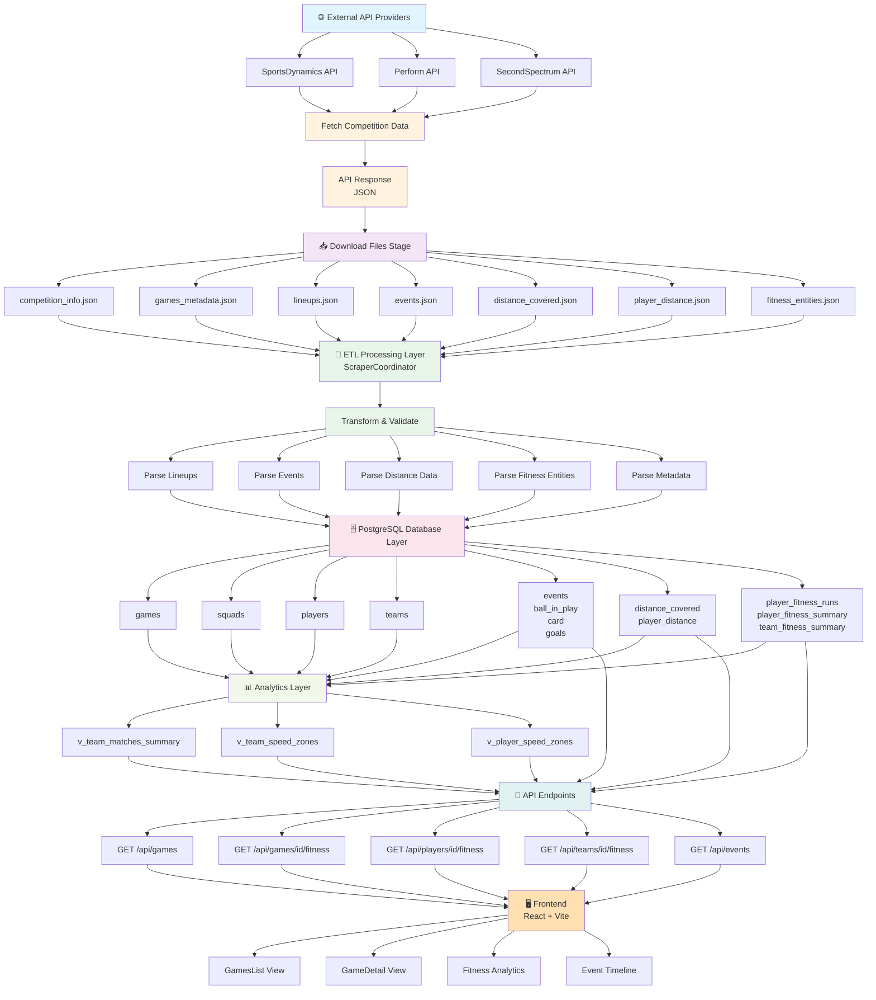
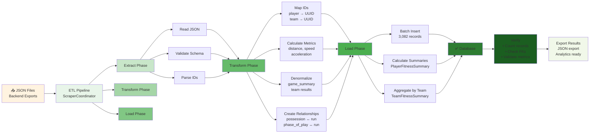
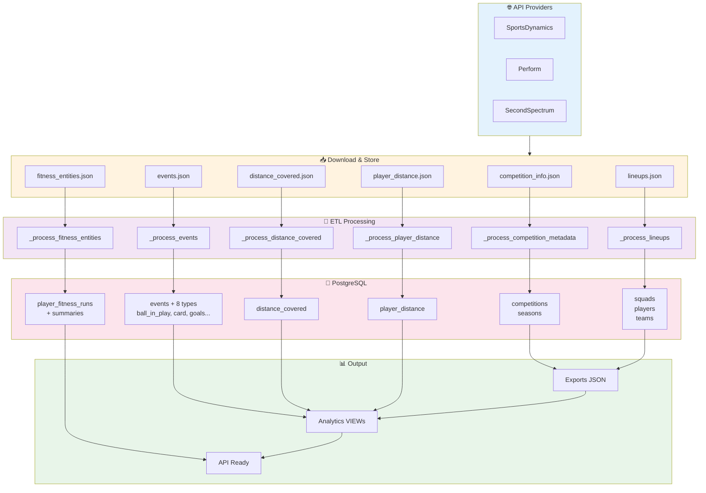
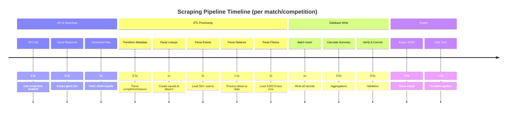

# 📊 Scomp Data Pipeline Workflow

Diagrammes du workflow complet de traitement des données : depuis la récupération via les API externes jusqu'à la visualisation frontend.

## 1️⃣ Workflow Complet (End-to-End)



Maintenant, voici un diagramme détaillé de la phase **ETL spécifique** :



Et un diagramme du **flux par fichier** :



**Timing du Pipeline:**


---

## 2️⃣ ETL Détaillé (Extract → Transform → Load)


---

## 3️⃣ Flux par Fichier JSON


---

## 📋 Résumé des Étapes

| Étape | Composant | Fichiers | Traitement | Sortie |
|-------|-----------|----------|-----------|--------|
| **1. API Call** | API Providers | - | Fetch competition data | JSON responses |
| **2. Download** | ScraperCoordinator | 6 fichiers | Store in `/exports/json_outputs/{game_id}/` | Files saved |
| **3. Extract** | Parser modules | `.json` | Read & validate schema | In-memory objects |
| **4. Transform** | Orchestrators | Objects | Map IDs, calculate metrics | Mapped data |
| **5. Load** | Database writer | Mapped data | Batch insert + FK checks | PostgreSQL tables |
| **6. Aggregate** | Summary calculator | DB records | PlayerFitnessSummary & TeamFitnessSummary | Aggregated metrics |
| **7. Verify** | Validator | DB state | Count records, check metrics | Quality report |
| **8. Export** | JSON exporter | Aggregations | Create match exports | JSON files |
| **9. Visualize** | API + Frontend | API calls | React components display | Web UI |

---

## ⚡ Performance Timeline

```
🌐 API Call & Response           : 0.5s
📥 Download 6 JSON Files         : 2.0s
🔄 ETL Processing                : 7.0s
   ├─ Parse lineups              : 1.0s
   ├─ Parse events (500+)        : 2.0s
   ├─ Parse distance             : 1.5s
   └─ Parse fitness (3,082)      : 3.0s
💾 Database Insert               : 1.0s
📊 Calculate Summaries           : 0.5s
✅ Verify & Commit               : 0.5s
📤 Export JSON                   : 0.5s
─────────────────────────────────────
📈 **TOTAL TIME PER COMPETITION** : ~13 seconds
```

---

## 🎯 Utilisation dans le Code

### Appel du pipeline:
```python
# backend/src/orchestration/scraper_coordinator.py
coordinator = ScraperCoordinator()
stats = coordinator.scrape_competition(
    provider='sportsdynamics',
    competition_id='comp_123'
)
```

### Pipeline complet exécuté:
1. **_fetch_competition_data()** → Appel API
2. **_download_files()** → Télécharge 6 fichiers JSON
3. **_process_competition_metadata()** → ETL métadonnées
4. **_process_lineups()** → ETL squads & joueurs
5. **_process_events()** → ETL événements (500+)
6. **_process_distance_covered()** → ETL distance
7. **_process_fitness_entities()** → ETL fitness (3,082 runs) ✅
8. **_verify_data()** → Validation
9. **export_to_json()** → Export résultats

---

## 📊 Fichiers JSON du Pipeline

| Fichier | Lignes | Contenu | Processeur |
|---------|--------|---------|-----------|
| **competition_info.json** | 50-100 | Meta: competition, season, dates | `_process_competition_metadata()` |
| **lineups.json** | 100-200 | Squads, players, positions | `_process_lineups()` |
| **events.json** | 500-1000 | Passes, shots, cards, goals | `_process_events()` |
| **distance_covered.json** | 100-200 | Team distance by zone & period | `_process_distance_covered()` |
| **player_distance.json** | 200-400 | Individual player distance data | `_process_player_distance()` |
| **fitness_entities.json** | 3,082 | Run tracking with 51 fields | `_process_fitness_entities()` |

---

## 💡 Notes Importantes

- ✅ **Idempotent**: Le pipeline peut être réexécuté sans dupliquer données
- ✅ **Transactionnel**: Rollback sur erreur
- ✅ **Validé**: FK constraints + data quality checks
- ⚡ **Performant**: Batch insert ~500 records/s
- 📊 **Analytics-Ready**: VIEWs créées automatiquement après load

