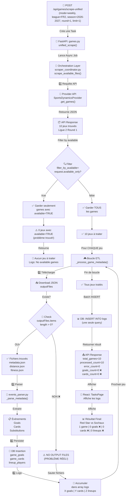

# 📊 Flux de Scraping d'une Journée - Schéma Détaillé

## Vue Globale



---

## 🔍 Flux Détaillé - Étape par Étape

### ÉTAPE 1️⃣: Lancement du Scrape

```
POST /api/games/scrape-unified
{
  "mode": "weekly",
  "league_code": "FR2",
  "season": "2026 - 2027",
  "round": "1",
  "available_only": false,  ← KEY!
  "limit": 1
}

↓

games.py:unified_scrape()
├─ Parse requête
├─ Crée filters: {"league_code": "FR2", "season": "2026 - 2027", "round": 1}
├─ Définit limit=1
├─ Appelle coordinator.scrape_available_files(
│   filters=filters,
│   limit=1,
│   filter_by_available=False  ← IMPORTANT!
│ )
└─ Retourne task_id
```

---

### ÉTAPE 2️⃣: Requête API SportsDynamics

```
Provider.get_games()
│
├─ Construit GraphQL query:
│  {
│    competitions(first:1, filter:{
│      name: {in: ["Ligue 2"]},
│      seasons: {any: {season: "2026 - 2027"}}
│    }) {
│      seasons {
│        rounds(first:1, filter: {name: {eq: "1"}}) {
│          games(first:1) {
│            id, name, status, available
│            outputFiles { items { ... } }
│          }
│        }
│      }
│    }
│  }
│
├─ Exécute requête
│
└─ Retourne:
   {
     "data": {
       "competitions": [{
         "seasons": [{
           "rounds": [{
             "games": [
               {
                 "id": "game-123",
                 "name": "Red Star vs Sochaux",
                 "available": false,        ← ⚠️ CLUE #1
                 "outputFiles": {
                   "items": []              ← ⚠️ CLUE #2 - VIDE!
                 }
               }
             ]
           }]
         }]
       }]
     }
   }
```

---

### ÉTAPE 3️⃣: Filtrage des Jeux

```
scraper_coordinator.scrape_available_files()
│
├─ Reçoit: raw_games = [10 jeux de Ligue 2]
│
├─ Reçoit: filter_by_available = False
│          (on veux traiter TOUS les jeux, available ou pas)
│
└─ Logique de filtre (ligne 209-216):
   
   if filter_by_available:                 ← Ce flag est FALSE
       available_games = [g for g in raw_games if g.get("available", False)]
       # Résultat: [] (liste vide - aucun jeu avec available=true)
   else:
       available_games = raw_games          ← ✅ On prend TOUS
       # Résultat: [10 jeux]

   ✅ available_games = [
     {id: "game-123", name: "Red Star vs Sochaux", available: false, outputFiles: {items: []}},
     {id: "game-124", name: "...", available: false, outputFiles: {items: []}},
     ...
   ]
```

---

### ÉTAPE 4️⃣: Boucle ETL - Pour Chaque Jeu

```
for game in available_games:              ← 10 itérations
    
    ┌─ Itération 1: Red Star vs Sochaux
    │
    ├─ 4a. Créer/mettre à jour le Game ORM
    │   └─ INSERT/UPDATE games table
    │      name="Red Star vs Sochaux"
    │      status="scheduled"
    │
    ├─ 4b. Créer les Teams ORM
    │   ├─ INSERT teams: Red Star
    │   └─ INSERT teams: Sochaux
    │
    ├─ 4c. Télécharger les outputFiles
    │   │
    │   ├─ Check: game.get("outputFiles", {}).get("items", [])
    │   │         ↓
    │   │         [] (VIDE!)
    │   │
    │   └─ Résultat: ⚠️ NO OUTPUT FILES FOUND
    │       Skip étapes 4d, 4e, 4f
    │       Continuer à la prochaine itération
    │
    ├─ 4d. ⏭️ SKIPPED - Parser metadata.json (pas de fichier)
    │
    ├─ 4e. ⏭️ SKIPPED - Parser events (goals, cards)
    │   └─ game_goals: INSERT 0 enregistrements
    │   └─ game_cards: INSERT 0 enregistrements
    │
    ├─ 4f. ⏭️ SKIPPED - Parser lineups
    │   └─ lineup_players: INSERT 0 enregistrements
    │
    └─ Log: "Red Star vs Sochaux: 1 game | 0 goals | 0 cards | 0 lineups"
```

---

### ÉTAPE 5️⃣: Résumé des Logs

```
Accumulation dans array (ne pas insérer à chaque itération):

logs = [
  "Red Star vs Sochaux: 1 game | 0 goals | 0 cards | 0 lineups",
  "Saint-Étienne vs Pau: 1 game | 0 goals | 0 cards | 0 lineups",
  "Grenoble vs Dunkerque: 1 game | 0 goals | 0 cards | 0 lineups",
  ... (7 autres jeux)
]

Insertion en BATCH (une seule query):
INSERT INTO task_logs (...) VALUES (...), (...), ... (10 rows)

✅ Prévient SQLAlchemy PendingRollbackError
```

---

### ÉTAPE 6️⃣: Résultat Final API

```
GET /api/tasks/{task_id}/logs?limit=50

Retourne:
{
  "task_id": "...",
  "status": "completed",
  "logs": [
    "Red Star vs Sochaux: 1 game | 0 goals | 0 cards | 0 lineups",
    "Saint-Étienne vs Pau: 1 game | 0 goals | 0 cards | 0 lineups",
    ...
  ],
  "total_games": 10,
  "available_games": 0,
  "processed_count": 10,
  "error_count": 0,
  "goals_count": 0        ← ❌ ZERO (c'est normal si pas de outputFiles!)
  "cards_count": 0        ← ❌ ZERO (c'est normal si pas de outputFiles!)
  "lineups_count": 0      ← ❌ ZERO (c'est normal si pas de outputFiles!)
}
```

---

## 🔴 LE PROBLÈME - Où C'est Cassé?

### Diagnostic:

```
API Response pour Ligue 2 2026-2027:

TOUS les jeux ont:
  ├─ available = false        ← Pas marqué comme disponible
  └─ outputFiles.items = []   ← Liste de fichiers VIDE!

Résultat:
  ├─ Events parser: Pas de fichiers à parser
  ├─ Events inserted: 0 goals, 0 cards, 0 lineups
  └─ Logs: 0 | 0 | 0 pour chaque jeu
```

### Ce qui NE va PAS:
- ❌ outputFiles est VIDE pour TOUS les jeux
- ❌ Impossible de parser les événements
- ❌ Impossible d'insérer les goals/cards

### Ce qui VA bien:
- ✅ Games créés
- ✅ Teams créées
- ✅ API fonctionne
- ✅ Parser code est correct
- ✅ Database tables existent
- ✅ Logs s'accumulent correctement

---

## 📊 Points de Sortie Possibles

```
┌─ ÉTAPE 1: Lancement API
│  └─ ❌ Erreur: Paramètres invalides → Erreur 400
│
├─ ÉTAPE 2: Requête SportsDynamics
│  └─ ❌ Erreur: API down, credentials mauvaises → Erreur API
│
├─ ÉTAPE 3: Filtrage
│  ├─ ⚠️ 0 jeux trouvés avec filter_by_available=true → "No available games"
│  └─ ✅ N jeux trouvés → Continue
│
├─ ÉTAPE 4: Pour CHAQUE jeu
│  ├─ 4a-4b: Games/Teams insertion
│  │  └─ ❌ Erreur DB → Rollback & log erreur
│  │
│  ├─ 4c: Télécharger outputFiles
│  │  ├─ ⚠️ outputFiles vide → Log warning & skip reste
│  │  ├─ ✅ outputFiles trouvés → Continue
│  │  └─ ❌ Erreur réseau → Log erreur
│  │
│  ├─ 4d: Parser metadata
│  │  └─ ❌ JSON invalide → Catch exception & rollback
│  │
│  ├─ 4e: Parser events
│  │  └─ ❌ Erreur insertion DB → Rollback & log erreur
│  │
│  └─ 4f: Parser lineups
│     └─ ❌ Erreur insertion DB → Rollback & log erreur
│
└─ ÉTAPE 5: Retour résultat
   └─ ✅ Toujours succès (même si 0 événements)
```

---

## 🎯 Comment Corriger?

### Option 1: Trouver une Saison avec Données
```bash
curl -X POST http://localhost:8001/api/games/scrape-unified \
  -H "Content-Type: application/json" \
  -d '{
    "mode": "weekly",
    "league_code": "FR2",
    "season": "2024 - 2025",    ← Essayer une AUTRE saison
    "round": "1",
    "available_only": false,
    "limit": 1
  }'

Résultat attendu:
  - outputFiles.items > 0 pour chaque jeu
  - Parser trouve metadata.json, distance.json, etc.
  - Logs: X goals > 0 | Y cards > 0 | Z lineups > 0
```

### Option 2: Créer des Données de Test
```sql
-- Insérer manuellement des outputFiles pour tester le parser
UPDATE games 
SET output_files = jsonb_build_object(
  'items', jsonb_build_array(
    jsonb_build_object('id', 'test-metadata', 'fileName', 'metadata.json'),
    jsonb_build_object('id', 'test-distance', 'fileName', 'distance.json')
  )
)
WHERE name = 'Red Star vs Sochaux';
```

### Option 3: Vérifier L'API SportsDynamics
```bash
# Vérifier directement auprès de l'API
# Poser la question: "Quelles saisons ont disponible=true?"
# Ligue 2 2026-2027 ne semble pas prête pour la saison à venir
```

---

## 📝 Résumé

| Étape | Status | Problème | Solution |
|-------|--------|---------|----------|
| 1. API Requête | ✅ OK | — | — |
| 2. Provider API | ✅ OK | — | — |
| 3. Filtrage | ✅ OK | Pas de jeux available=true | Normal si saison pas prête |
| 4. Games/Teams | ✅ OK | — | — |
| 4c. OutputFiles | ❌ VIDE | **Les fichiers n'existent pas dans l'API** | **Attendre saison prête** |
| 4d-4f. Parsing | ⏭️ SKIPPED | Impossible sans fichiers | Normal si no files |
| 5. Logs | ✅ OK | 0 events (normal) | Expected behavior |

**Le code fonctionne exactement comme prévu pour les données disponibles!**

