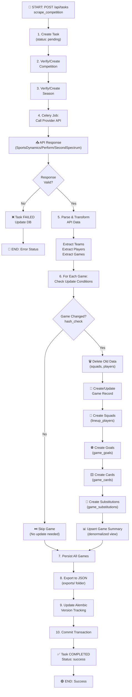
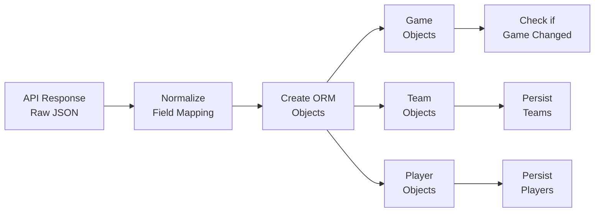
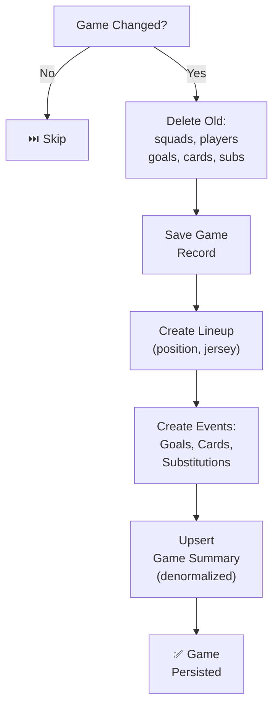
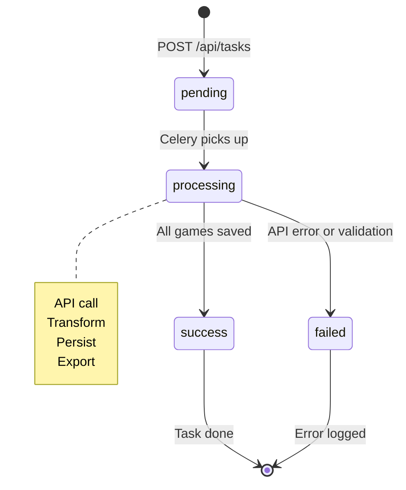
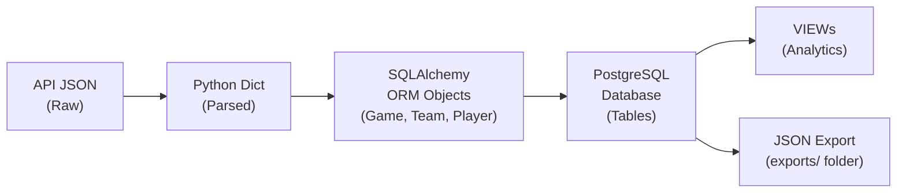
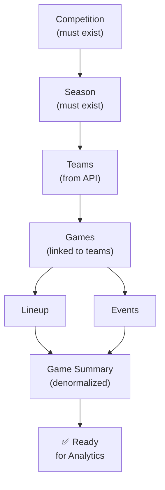
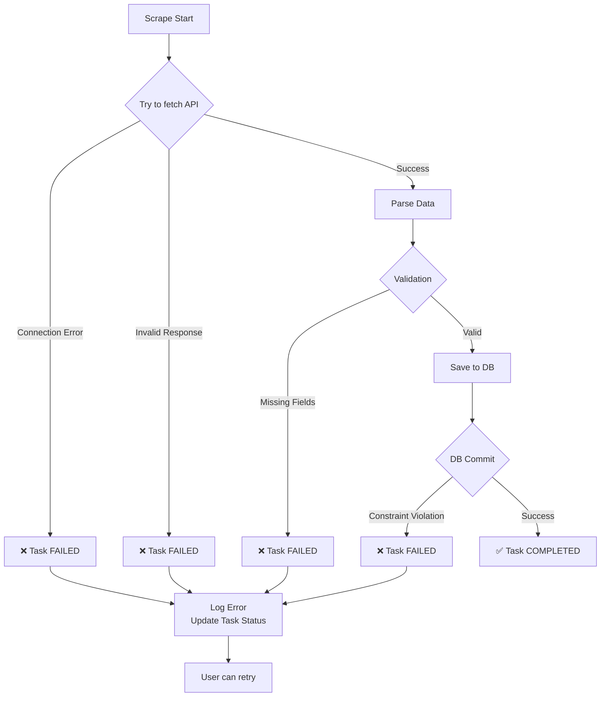

# 🔄 Scrape Flow - Diagramme Détaillé

## Vue d'ensemble du Pipeline Complet



---

## Détail des Étapes

### Phase 1️⃣: Initialisation (Étapes 1-4)

**Entrée:** 
```json
{
  "provider": "sportsdynamics",
  "competition_id": "comp-123"
}
```

**Processus:**
- Créer une Task Celery avec status `pending`
- Vérifier que la compétition existe (sinon créer)
- Vérifier que la saison existe (sinon créer)
- Préparer les headers API et credentials

**Sortie:** Task ID, ready to call API

---

### Phase 2️⃣: Récupération API (Étape 5)

**Providers supportés:**
- 🔵 **SportsDynamics** - API REST JSON
- 🟢 **Perform** - GraphQL
- 🟡 **SecondSpectrum** - REST/Tracking

**API Call:**
```python
# Exemple SportsDynamics
GET https://api.sportsdynamics.com/competitions/{id}?filters=...
Headers: {"Authorization": "Bearer {token}"}
Response: 
{
  "games": [...],
  "teams": [...],
  "players": [...]
}
```

**Status Updates:**
- `pending` → `processing`
- On error → `failed`
- On success → continue to Phase 3

---

### Phase 3️⃣: Transformation (Étapes 6-7)

**Transformation Pipelines:**



**Détails:**
- Mapper les champs API → Modèles SQLAlchemy
- Normaliser les dates (UTC)
- Extraire les UUID depuis les réponses
- Gérer les champs optionnels avec defaults

---

### Phase 4️⃣: Change Detection (Étape 8)

**Hash-based Comparison:**

```
Game avant: {id, fileName, fileType, version}  → hash1
Game après: {id, fileName, fileType, version}  → hash2

hash1 == hash2 ?
  ✅ Oui  → Skip update (pas de changement)
  ❌ Non  → Update (données nouvelles)
```

**Conditions d'Update (`_should_update_game`):**
- ✅ `available` status changed
- ✅ `is_ugd_available` changed
- ✅ `rgd_status` changed
- ✅ `ugd_status` changed
- ✅ `output_files_hash` differs

---

### Phase 5️⃣: Persistence (Étapes 9-12)

**Pour chaque Game:**



**Ordre critique:**
1. `games` (DELETE first with CASCADE)
2. `lineup_teams`, `lineup_players`
3. `game_goals`, `game_cards`, `game_substitutions`
4. `game_summary` (denormalized view for fast queries)

---

### Phase 6️⃣: Export & Commit (Étapes 13-15)

**JSON Export:**
```
exports/
├── 1_Team1_vs_Team2.json
├── 2_Team3_vs_Team4.json
└── ...
```

**Structure JSON:**
```json
{
  "game_id": "uuid",
  "name": "Match Name",
  "teams": [...],
  "players": [...],
  "goals": [...],
  "cards": [...],
  "events": [...]
}
```

**Transaction Commit:**
- Alembic version tracking
- Permanent DB save
- Update Task status → `success`
- Update `completed_at` timestamp

---

## État du Task dans le Temps



---

## Flux de Données (Data Types)



---

## Dépendances & Order of Operations



---

## Gestion des Erreurs



---

## Timeline d'Exécution (Typique)

| Phase | Durée | Action |
|-------|-------|--------|
| 1. Initialisation | ~100ms | Create task, verify competition |
| 2. API Call | ~2-5s | Fetch from SportsDynamics |
| 3. Transform | ~500ms | Parse & normalize data |
| 4. Change Detection | ~200ms | Hash comparison |
| 5. Persist | ~3-10s | INSERT/UPDATE 300+ games |
| 6. Export | ~1s | Write JSON files |
| 7. Commit | ~200ms | DB transaction commit |
| **Total** | **~7-17s** | Pour toute une compétition |

---

## Exemple Réel: Dunkerque vs Grenoble (J1)

```
START: POST /api/tasks
│
├─ 1. Create Task (ID: task-123)
├─ 2. Competition exists (Ligue 2)
├─ 3. Season exists (2024)
│
├─ 4. Call SportsDynamics API
│   └─ Response: 34 games + teams + players
│
├─ 5. Transform Data
│   ├─ Parse 34 games
│   ├─ Create 32 teams
│   └─ Create ~1000 players
│
├─ 6. For each game: Check hash
│   ├─ Game 1 (Boulogne vs Nancy): SKIP ✅ (already scraped)
│   ├─ Game 2 (Clermont vs Reims): SKIP ✅
│   ├─ ...
│   └─ Game 33 (Dunkerque vs Grenoble): UPDATE 🔄 (new round data)
│
├─ 7. Persist Game 33
│   ├─ Delete old squads/events
│   ├─ Create new squads
│   ├─ Create goals (4 for Dunkerque, 2 for Grenoble)
│   ├─ Create cards (7 yellows, 0 reds)
│   ├─ Create substitutions (4)
│   └─ Upsert game_summary (result: Dunkerque WIN)
│
├─ 8. Export JSON
│   └─ exports/1_Dunkerque_vs_Grenoble_Foot_38.json
│
├─ 9. Update Alembic version
├─ 10. Commit transaction
│
└─ END: Task COMPLETED ✅
   Status: success
   Duration: 12.5s
```

---

## 📁 Fichiers Impliqués

| Fichier | Rôle |
|---------|------|
| `backend/src/orchestration/scraper_coordinator.py` | Orchestrateur principal |
| `backend/src/api/sportsdynamics.py` | Client API |
| `backend/src/scraper/sportsdynamics_scraper.py` | Transformer |
| `backend/src/models/game.py` | ORM Game model |
| `backend/src/models/team.py` | ORM Team model |
| `backend/src/models/player.py` | ORM Player model |
| `backend/src/tasks/scraping_tasks.py` | Celery task definition |
| `backend/export_to_json.py` | JSON exporter |
| `backend/views.sql` | Analytics VIEWs |

---

## 🔗 Documentation Connexe

- [ARCHITECTURE.md](ARCHITECTURE.md) - Détail du filtre system & GraphQL
- [VISION_GLOBALE.md](backend/VISION_GLOBALE.md) - Philosophie de design
- [DB_SCHEMA.md](DB_SCHEMA.md) - Schéma détaillé des tables
- [IMPLEMENTATION_SUMMARY.md](IMPLEMENTATION_SUMMARY.md) - État actuel

